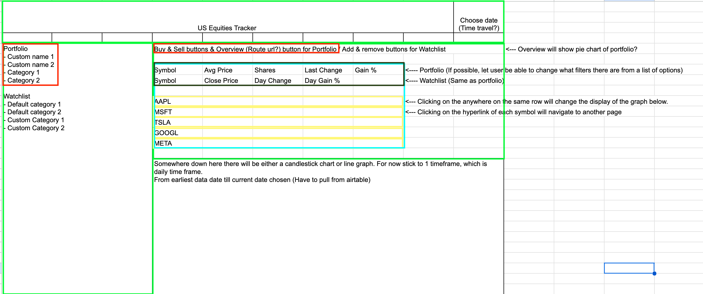
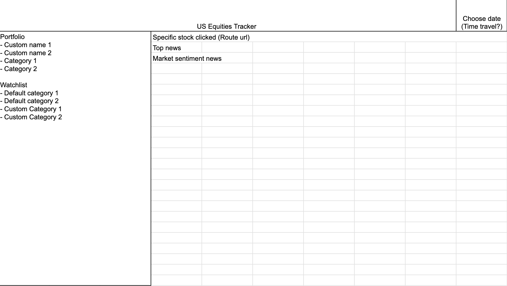

# React + Vite

## Technical Requirements

### Your App Must

☐ **Use 3rd party API and Airtable**

- Calling an API and displaying the data for the user. You may use any API of your choosing or [Find an available API here](https://github.com/public-apis/public-apis)
- You must use Airtable (but **NOT** the [airtable client](https://github.com/Airtable/airtable.js)) to store data.

☐ **Use React framework** to build your application with _at least_

- 5 components
- 4 props
- 2 useStates
- 2 react router routes
- 1 lifting state, which is used to implement CRUD on the client side

☐ Be styled such that the app looks and feels similar to apps we use on a daily basis - in other words, **it should have a consistent and polished user interface.**

☐ Be **deployed online** (Vercel).

☐ Have **full-CRUD single model operations** somewhere within the app's features. For example, you can have functionality that **C**reates & **U**pdates & **D**elete by implementing the ability to CRUD _favourites_.

### Optionally, Your App May

☐ - Use more than 1 API

☐ - Use more than 1 model with Airtable

☐ - Have **suitable validations** and/or `fetch` loading states

☐ - Use a React component library like [Ant Design](https://ant.design/docs/react/introduce) or [Material UI](https://material-ui.com/)

☐ - Use a CSS Framework from [a list](https://github.com/troxler/awesome-css-frameworks) or a design system like [Tailwind CSS](https://tailwindcss.com/)

---

## Necessary Deliverables

☐ **A working react app that meets or exceeds the above technical requirements, built by you, and hosted on Vercel**.

- **A `README.md` file** with these sections:

  ☐ **App Title:** Contains a description of what the app does and optional background info.

  ☐ **Screenshot(s):** A screenshot of your app's landing page and any other screenshots of interest.

  ☐ **Technologies Used**: List of the technologies used.

  ☐ **Getting Started**: Include a link to the deployed app and your Trello board with the project's planning.

  ☐ **Next Steps**: Planned future enhancements (icebox items).

  > Note: Don't underestimate the value of a well crafted `README.md`. The `README.md` introduces your project to prospective employers and forms their first impression of your work!

☐ **Daily commits (the more the better) dating back to the very beginning of the project**. Commit messages should be in the present tense, e.g., "Style landing page" instead of "Styled landing page". **Do not "start over" with a new repo.**

---

## Getting Started

- **Discuss your app idea with an instructor to get their feedback before you dive too deep into user stories and wireframes.**
- Because your app's functionality revolves around the API, **implement routes and basic fetching first!**
- **Remember to keep things small and focus on the MVP** – feature creep can doom a project!
<!-- - **Prioritize and implement the user stories one at a time** by following the [Guide to Add a Feature to a Web App](guide-to-add-feature-to-web-app.md).
- **Follow the guidance and concepts in the** [Guide to User-Centric CRUD](guide-to-user-centric-crud.md). -->

---
