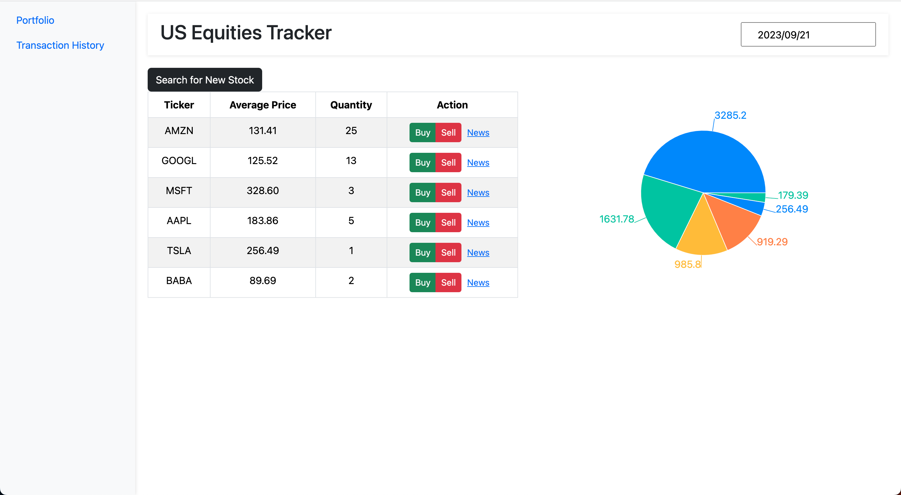

# Stock Market Watch

## Description

Stock Market Watch is a portfolio watcher. It allows the user to keep track of their assets and browse news and stock charts. This README provides an overview of the app, the technologies used, how to get started, and future plans.

## Screenshots

## Technologies Used

- React: A JavaScript library for building user interfaces.
- Node.js: A runtime environment for executing JavaScript code on the server-side.
- Airtable: Used for data storage and retrieval.
- React Bootstrap: A popular UI framework for building responsive web applications using React components.
- Recharts: A charting library for creating interactive and visually appealing charts and graphs in React applications.
- Two External Stock APIs: Integrated external APIs for data retrieval.

## Getting Started

To try out Stock Market Watch, you can access the deployed app at [Deployed App](https://stock-market-watch.vercel.app/). Additionally, you can view the project's planning and progress on my [Github Projects](https://github.com/users/marcusawd/projects/1).

## Next Steps

Here are some of the planned enhancements:

- [Buy & Sell buttons]: Allow to buy and sell from clicking buttons
- [Profit and Loss]: To add funtionality of calculating profit and losses based on portfolio and current date

Feel free to contribute to the project or provide feedback by creating issues or pull requests in the repository.

Thank you for checking out Stock Market Watch!
